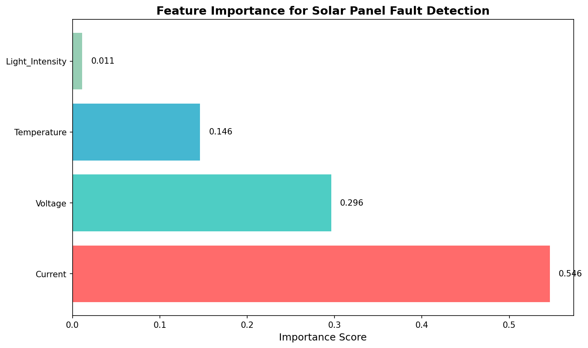

# ☀️ Solar Panel Fault Detection System

An AI-powered fault detection system for solar panels using **Random Forest machine learning**, with support for real hardware (ESP32/Arduino) and a beautiful **Next.js web dashboard**.



## 🌟 Features

- **🤖 Machine Learning**: Random Forest classifier trained on synthetic solar panel data
- **📊 Real-time Dashboard**: Beautiful Next.js frontend with live sensor monitoring
- **🔌 Multi-Connection Modes**:
  - **Simulator**: Demo mode for presentations (no hardware needed)
  - **ESP32 WiFi**: Wireless connection to ESP32 microcontroller
  - **Arduino Nano USB**: Wired serial connection
- **📈 Live Visualizations**: Interactive charts, gauges, and fault distribution
- **🎯 Fault Detection**: Identifies Normal, Open Circuit, Partial Shading, and Short Circuit conditions

---

## ⚠️ Important: Requirements & Compatibility

**Before installing, please read**: [🔍 Complete Compatibility Report](COMPATIBILITY_REPORT.md)

**Key Points**:
- ✅ **Python 3.9+ REQUIRED** (3.10 or 3.12 recommended)
- ❌ **Python 3.8 NOT SUPPORTED** (NumPy/Pandas 2.x require 3.9+)
- **`requirements.txt`** - Optimized & minimal (13 packages, ~500MB)
  - Use this for **running the system** (recommended)
- **`requirements-ml.txt`** - Optional ML training packages
  - Use this **only if** you want to retrain models yourself
- **Old root requirements.txt** has been simplified (removed bloated 89 packages)

**Installation**:
```bash
# Verify Python version first
python --version  # Must show 3.9+

# Install
pip install -r requirements.txt  # All you need to run the system
```

---

## 📁 Project Structure

```
solar-panel-monitor/
├── backend/                    # FastAPI backend server
│   ├── main.py                 # REST API + WebSocket server
│   └── requirements.txt        # Python dependencies
├── frontend/                   # Next.js web application
│   ├── src/app/
│   │   ├── page.tsx            # Main dashboard
│   │   ├── layout.tsx          # App layout
│   │   └── globals.css         # Styles
│   └── package.json            # Node dependencies
├── ml/                         # Machine learning scripts
│   ├── step1_generate_synthetic_data.py
│   ├── step2_train_random_forest.py
│   └── step3_export_to_esp32.py
├── models/                     # Trained model artifacts
│   ├── solar_fault_rf_model.joblib
│   ├── solar_fault_scaler.joblib
│   ├── solar_fault_label_encoder.joblib
│   ├── model.h                 # C code for ESP32 (micromlgen)
│   └── model_manual.h          # Manual C code export
├── firmware/                   # Microcontroller code
│   ├── esp32_wifi/             # ESP32 WiFi firmware
│   │   ├── esp32_wifi_firmware.ino
│   │   └── model_embedded.h
│   └── arduino_nano/           # Arduino Nano firmware
│       ├── arduino_nano_firmware.ino
│       └── WIRING_GUIDE.md
├── data/                       # Training data
│   └── solar_panel_dataset.csv
├── assets/                     # Images and visualizations
│   ├── confusion_matrix.png
│   ├── decision_tree.png
│   └── feature_importance.png
├── .gitignore
└── README.md
```

## 🚀 Running the Project

### System Requirements
- **Python**: 3.9+ (3.10.x or 3.12.x recommended) ⚠️ **NOT compatible with 3.8**
- **Node.js**: 16+
- **RAM**: 2GB minimum
- **Disk**: 500MB free space
- **OS**: Windows 10/11, macOS, or Linux

✅ **[Read Compatibility Report](COMPATIBILITY_REPORT.md)** for detailed compatibility info

### Full Setup Instructions

#### Step 1: Verify Python Version
```bash
python --version  # Must show 3.9 or higher
```

If you have Python 3.8, please upgrade to 3.9+ from [python.org](https://www.python.org/downloads/)

#### Step 2: Clone & Navigate to Project
```bash
cd SolarPanelFaultDetection
```

#### Step 3: Setup Backend (FastAPI Server)

**Create & Activate Virtual Environment:**
```bash
# Windows
python -m venv .venv
.venv\Scripts\activate

# Mac/Linux
python3 -m venv venv
source venv/bin/activate
```

**Install Dependencies:**
```bash
# Minimal setup (recommended for running the system)
pip install -r requirements.txt

# Optional: If you want to train/retrain ML models
pip install -r requirements-ml.txt
```

**Verify Installation:**
```bash
python -c "import fastapi; import sklearn; print('✅ All core packages installed')"
```

**Start Backend Server:**
```bash
cd backend
python main.py
```

✅ **Backend runs on**: `http://localhost:8000`

**Check API health:**
```bash
curl http://localhost:8000/api/predict
```

#### Step 3: Setup Frontend (Next.js Dashboard)

**In a new terminal, navigate to frontend:**
```bash
cd frontend
npm install
npm run dev
```

✅ **Frontend runs on**: `http://localhost:3000` (or 3001 if 3000 is in use)

#### Step 4: Access the Dashboard
Open your browser and go to:
```
http://localhost:3000
```

---

## 🎮 Connection Modes

The system supports **three connection modes** for different use cases:

### Mode 1: Simulator (Demo - No Hardware Needed)
✅ Perfect for testing and presentations

**Steps:**
1. Start both backend and frontend
2. On the dashboard, see connection mode selector in top-right
3. Select **"Simulator"** mode
4. Click **"Start Monitoring"**
5. System generates realistic simulated sensor data
6. Select fault type from dropdown to inject faults
7. Watch real-time predictions and charts update

**Features:**
- No hardware required
- Instant data generation
- Toggle different fault types on-the-fly
- Simulated data saved to `data/simulatedstationX.csv`

---

### Mode 2: ESP32 WiFi (Wireless Hardware)
🔌 Real hardware with wireless connection

**Setup:**
1. Flash firmware to ESP32: `firmware/esp32_wifi/esp32_firmware.ino`
2. Update WiFi credentials in firmware
3. Update backend IP address in firmware
4. Deploy ESP32 with sensors

**On Dashboard:**
1. Select **"WiFi"** mode
2. Ensure ESP32 is connected to same network
3. Click **"Start Monitoring"**
4. Real sensor data streams in real-time
5. Data saved to `data/station1.csv`

**Sensor Formula:**
- Voltage: Raw ADC → Scaled to 0-30V
- Current: ACS712 hall sensor → Scaled to Amps

---

### Mode 3: Arduino USB (Wired Hardware)
📡 Direct serial connection via USB

**Setup:**
1. Connect Arduino Nano via USB cable
2. Open Device Manager → Note COM port (e.g., COM3)
3. Ensure Arduino runs firmware: `firmware/arduino_nano/arduino_nano_firmware.ino`

**On Dashboard:**
1. Select **"USB"** mode
2. Choose COM port from available ports
3. Click **"Start Monitoring"**
4. Data streams over serial connection
5. Data saved to `data/station1.csv`

---

## 📊 CSV Data Logging & Download

### Auto Logging
All sensor readings are **automatically logged** to CSV files:
- **Actual hardware data**: `data/station1.csv`, `data/station2.csv`
- **Simulated data**: `data/simulatedstation1.csv`, `data/simulatedstation2.csv`

### Download CSV Files
1. Stop monitoring (optional, you can download while monitoring)
2. Scroll to right panel → **"Download CSV Data"** section
3. Select **Station** (1 or 2)
4. Select **Data Type** (Hardware Data or Simulated Data)
5. View file info (size, record count)
6. Click **"Download CSV"** button
7. File saves as `station1_actual_data.csv` (or variant based on selection)

### CSV Format
```
timestamp,sender_id,voltage,current,temperature,light_intensity,humidity,thermistor_temp,efficiency,relay_status,fault_type,fault_index,confidence,is_fault,power,recommendation
2025-03-25T14:32:45.123,1,22.5,0.85,45.2,850,65.0,48.3,92.5,1,Normal,0,0.95,False,19.125,✅ System operating normally
```

**Columns**: 16 parameters including timestamp, sensor readings, and ML predictions

---

## ⚠️ Important: CSV File Locking Issue (Windows)

### Problem
When you **open CSV files in Excel**, Windows locks them. The backend temporarily cannot write new data.

### Solution
A **red warning banner** appears on the dashboard when files are locked:
- Shows which CSV files are locked
- Instructs you to close the files in Excel
- Automatically disappears when files are unlocked
- Backend **retries automatically** every 50-200ms

### How It Works
1. Data arrives → Backend tries to write
2. File is locked in Excel → Error detected
3. Backend waits 50ms → Retries
4. Still locked? Waits 100ms → Retries
5. Still locked? Waits 200ms → Retries (final)
6. If still locked → Warning shown to user
7. When Excel is closed → Data resumes immediately ✅

### Best Practice
- **Option A**: Keep CSV files closed while monitoring
- **Option B**: Download CSV files instead of opening directly
- **Option C**: Use Excel "Read-Only" mode to avoid locks

---

## 🔧 Advanced Usage

### Train Your Own Model (Optional)

This is **only needed** if you want to retrain the ML model with new data.

**Setup for ML Training:**
```bash
# Install ML dependencies (one-time)
pip install -r requirements-ml.txt

# Then run training pipeline
cd ml/
python step1_generate_synthetic_data.py
python step2_train_random_forest.py
python step3_export_to_esp32.py
```

**What this does:**
- Generates 1000 synthetic solar panel readings
- Trains a Random Forest classifier
- Exports model to `../models/` and embedded C code
- Pre-trained models already included, so this is optional

### API Endpoints

**Core Endpoints:**
| Endpoint | Method | Description | Example |
|----------|--------|-------------|---------|
| `/api/predict` | POST | Get fault prediction | `curl -X POST http://localhost:8000/api/predict -H "Content-Type: application/json" -d '{"voltage":22.5, "current":0.85, ...}'` |
| `/api/simulate` | GET | Get simulated data | `curl http://localhost:8000/api/simulate?fault_type=3` |
| `/api/gateway-data` | POST | Receive ESP32 data | Hardware posts here |
| `/ws` | WebSocket | Real-time streaming | `ws://localhost:8000/ws` |

**CSV Management Endpoints:**
| Endpoint | Method | Description |
|----------|--------|-------------|
| `/api/csv/status` | GET | Check CSV logging status |
| `/api/csv/locked-status` | GET | Check if any CSV files are locked |
| `/api/csv/export/{station_id}` | GET | Download CSV file |
| `/api/csv/stats/{station_id}` | GET | Get file size & record count |
| `/api/csv/clear/{station_id}` | POST | Delete CSV file |
| `/api/csv/toggle` | POST | Enable/disable logging |

---

## 🐛 Troubleshooting

### Backend won't start
```
ERROR: Port 8000 already in use
```
**Solution**: Kill the process or use different port:
```bash
python main.py --port 8001
```

### Frontend won't compile
```
ENOENT: no such file or directory
```
**Solution**: Clear cache and reinstall:
```bash
cd frontend
rm -rf node_modules .next
npm install
npm run dev
```

### CSV data not saving
1. Check if backend is running: `http://localhost:8000/api/csv/status`
2. Check if files are locked on dashboard (red warning banner)
3. Verify `data/` folder exists and has write permissions
4. Check logs for errors

### No data streaming from ESP32
1. Verify ESP32 is on same WiFi network
2. Check ESP32 firmware has correct backend IP
3. Verify serial monitor shows data transmission
4. Test gateway endpoint: `curl http://your-esp32-ip:8000/api/gateway-data`

### Arduino USB not connecting
1. Check USB cable is connected
2. Verify correct COM port in Device Manager
3. Arduino firmware correctly flashed
4. Try different USB port if available
5. Restart Arduino IDE and dashboard

---

## 🚀 Quick Start

## 🔧 Hardware Setup (ESP-NOW Gateway)

The system uses a **Gateway Architecture** for robust multi-node monitoring.

### 1. Gateway Node (ESP32)
*   **Role**: Receives data from sensors via ESP-NOW, aggregates it, and sends it to the Backend via WiFi.
*   **Firmware**: `firmware/esp32_gateway_system/gateway_node/gateway_node.ino`
*   **Setup**:
    1.  Open in Arduino IDE.
    2.  Update `ssid` and `password` for your WiFi.
    3.  Update `flaskServerUrl` to your computer's IP (e.g., `http://192.168.1.69:8000/api/gateway-data`).
    4.  Flash to ESP32 and **note down its MAC address**.

### 2. Sender Node (Sensor ESP32)
*   **Role**: Reads sensors (Voltage, Current, DHT, LDR) and sends data to Gateway.
*   **Firmware**: `firmware/esp32_gateway_system/sender_node/sender_node.ino`
*   **Setup**:
    1.  Update `centralNodeAddress` with your **Gateway's MAC address**.
    2.  Set `SENDER_ID` (e.g., 1 for first node, 2 for second).
    3.  Flash to a different ESP32.

### 3. Register Sender
*   Go back to `gateway_node.ino`.
*   Add your Sender's MAC address to the `sender1_mac` (or `sender2_mac`) variable.
*   Re-flash the Gateway.

### Legacy Modes (Optional)
*   **Standalone WiFi**: `firmware/esp32_wifi/` (Direct connection, no gateway)
*   **Arduino Nano**: `firmware/arduino_nano/` (USB Serial connection)

## 📊 Fault Types

| Fault Type | Characteristics | Icon |
|------------|-----------------|------|
| **Normal** | High voltage, normal current, high light | ✅ |
| **Open Circuit** | High voltage, near-zero current | 🔌 |
| **Partial Shading** | Reduced voltage, variable current | 🌤️ |
| **Short Circuit** | Very low voltage, high current | ⚡ |

## 🛠️ API Endpoints

| Endpoint | Method | Description |
|----------|--------|-------------|
| `/api/predict` | POST | Get fault prediction for sensor data |
| `/api/simulate` | GET | Get simulated sensor data |
| `/api/serial-ports` | GET | List available COM ports |
| `/api/set-simulation-mode` | POST | Set simulation fault type |
| `/ws` | WebSocket | Real-time data streaming |

## 📦 Dependencies

### Backend
- FastAPI
- uvicorn
- scikit-learn
- joblib
- pyserial
- websockets

### Frontend
- Next.js 14
- React 18
- TypeScript
- Tailwind CSS
- Framer Motion
- Recharts
- Lucide Icons

## 📈 Model Performance

- **Algorithm**: Random Forest (10 trees, max depth 5)
- **Accuracy**: 100% on test set
- **Features**: Voltage, Current, Temperature, Light Intensity
- **Classes**: Normal, Open_Circuit, Partial_Shading, Short_Circuit

## 📝 License

MIT License - feel free to use for educational and personal projects.

## 🤝 Contributing

Pull requests are welcome! For major changes, please open an issue first.

---

Made with ❤️ for solar energy monitoring
