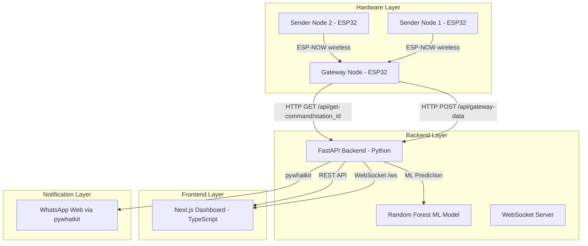
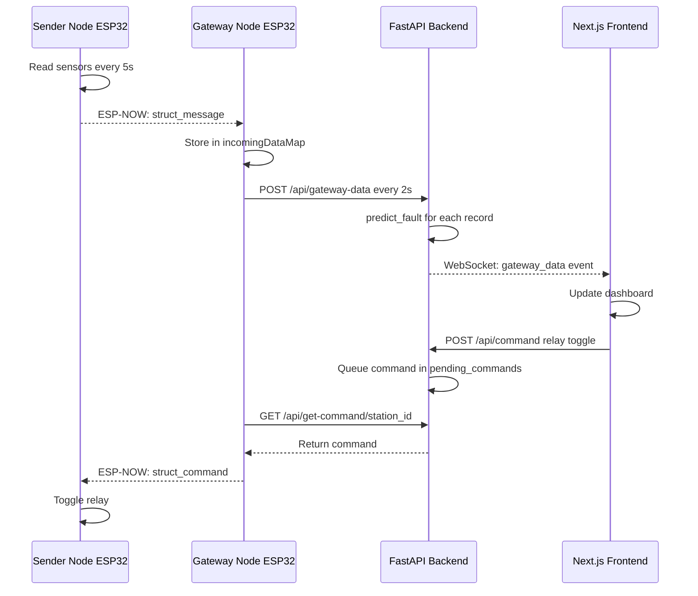
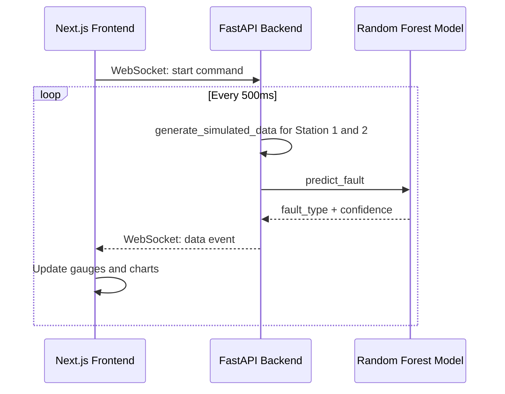

# Solar Panel Fault Detection System - Codebase Overview

## 🏗️ System Architecture



---

## 📁 Project Structure

```
SolarPanelFaultDetection/
├── backend/
│   ├── main.py                        # FastAPI server (REST + WebSocket)
│   ├── requirements.txt               # Python dependencies
│   ├── solar_fault_rf_model.joblib    # Trained Random Forest model
│   ├── solar_fault_scaler.joblib      # Feature scaler
│   ├── solar_fault_label_encoder.joblib # Label encoder
│   └── solar_fault_feature_names.joblib # Feature names
├── frontend/
│   ├── src/app/
│   │   ├── page.tsx                   # Main dashboard (single-page app)
│   │   ├── layout.tsx                 # App layout
│   │   └── globals.css                # Tailwind + custom styles
│   ├── package.json
│   └── next.config.js
├── firmware/
│   ├── esp32_gateway_system/
│   │   ├── gateway_node/
│   │   │   └── gateway_node.ino       # Gateway ESP32 firmware
│   │   ├── sender_node/
│   │   │   └── sender_node.ino        # Sender Node 1 firmware
│   │   └── sender_node_A/
│   │       └── sender_node_A.ino      # Sender Node 2 firmware
│   └── esp32_wifi/
│       ├── esp32_wifi_firmware.ino    # Standalone WiFi firmware
│       └── model_embedded.h           # Embedded ML model for ESP32
├── data/
│   ├── solar_panel_dataset.csv        # Training dataset (synthetic)
│   └── solar_data.csv                 # Extended dataset
├── libraries/                         # Arduino/ESP32 libraries
│   ├── ACS712/                        # Current sensor library
│   ├── ArduinoJson/                   # JSON serialization
│   ├── AS7331/                        # UV sensor library
│   └── CppPotpourri/                  # Utility library
└── README.md
```

---

## 🔧 Component Deep Dive

### 1. Backend (`backend/main.py`)

**Framework**: FastAPI (Python) with uvicorn ASGI server

**Key Classes & Models**:
- [`SensorData`](backend/main.py:70) — Pydantic model for incoming sensor readings (voltage, current, temperature, light_intensity, humidity, thermistor_temp, efficiency, relay_status)
- [`PredictionResponse`](backend/main.py:80) — ML prediction output (fault_type, confidence, is_fault, power, efficiency, recommendation)
- [`GatewayRecord`](backend/main.py:104) — Data structure received from ESP32 Gateway (maps to SensorData)
- [`AppState`](backend/main.py:120) — Global singleton managing model, connections, relay states, WebSocket clients, and WhatsApp config
- [`ConnectionConfig`](backend/main.py:94) — Connection mode config (simulator / serial / wifi)

**Core Functions**:
- [`generate_simulated_data()`](backend/main.py:203) — Generates realistic synthetic sensor data for 5 fault profiles
- [`predict_fault()`](backend/main.py:368) — Runs ML inference using loaded Random Forest model
- [`calculate_efficiency()`](backend/main.py:356) — Computes panel efficiency from voltage, current, and light
- [`send_whatsapp_notification()`](backend/main.py:273) — Async wrapper for WhatsApp alerts (with cooldown logic)
- [`send_whatsapp_sync()`](backend/main.py:232) — Blocking pywhatkit call run in a background thread

**REST API Endpoints**:

| Endpoint | Method | Description |
|---|---|---|
| `/` | GET | Health check |
| `/api/status` | GET | System status |
| `/api/predict` | POST | Run ML prediction on sensor data |
| `/api/simulate` | GET | Get simulated data + prediction |
| `/api/set-simulation-mode` | POST | Set fault type for simulator |
| `/api/gateway-data` | POST | Receive batch data from ESP32 Gateway |
| `/api/serial-ports` | GET | List available COM ports |
| `/api/connect` | POST | Set connection mode (simulator/serial/wifi) |
| `/api/disconnect` | POST | Disconnect and reset to simulator |
| `/api/fault-types` | GET | List all fault types with metadata |
| `/api/recommendations` | GET | Get fault recommendations |
| `/api/command` | POST | Queue relay command for a station |
| `/api/get-command/{station_id}` | GET | Gateway polls for pending commands |
| `/api/relay-status/{station_id}` | GET | Get relay state for a station |
| `/api/test-relay/{station_id}` | POST | Test relay command directly |
| `/api/whatsapp/configure` | POST | Configure WhatsApp phone number |
| `/api/whatsapp/test` | POST | Send test WhatsApp message |
| `/api/whatsapp/status` | GET | Get WhatsApp notification status |
| `/api/system-status` | GET | Full system debug status |
| `/ws` | WebSocket | Real-time bidirectional data stream |

**WebSocket Protocol** (`/ws`):
- Client → Server commands: `start`, `stop`, `set_fault`, `configure_whatsapp`
- Server → Client messages: `{ type: "data", sender_id, sensor_data, prediction }` or `{ type: "gateway_data", ... }` or `{ type: "relay_command_acknowledged", ... }`

---

### 2. ML Model

**Algorithm**: Random Forest Classifier (scikit-learn)
- **10 trees**, max depth 5
- **Features** (5): Voltage, Current, Temperature, Light_Intensity, Efficiency
- **Classes** (5): Normal, Open_Circuit, Partial_Shading, Short_Circuit, Dust_Accumulation
- **Accuracy**: 100% on test set (synthetic data)

**Fault Profiles** (used in simulator):

| ID | Fault | Voltage (V) | Current (A) | Temp (°C) | Light (lux) |
|---|---|---|---|---|---|
| 0 | Normal | 17–22 | 4–6 | 25–45 | 800–1200 |
| 1 | Open_Circuit | 20–25 | 0–0.15 | 25–40 | 700–1200 |
| 2 | Partial_Shading | 8–15 | 1–3.5 | 30–55 | 150–450 |
| 3 | Short_Circuit | 0–4 | 6–10 | 55–85 | 500–1200 |
| 4 | Dust_Accumulation | 14–19 | 3–5 | 35–55 | 400–700 |

**Model artifacts** (stored in `backend/`):
- `solar_fault_rf_model.joblib` — Trained classifier
- `solar_fault_scaler.joblib` — StandardScaler for feature normalization
- `solar_fault_label_encoder.joblib` — LabelEncoder for class names

---

### 3. Frontend (`frontend/src/app/page.tsx`)

**Framework**: Next.js 14 (App Router), React 18, TypeScript, Tailwind CSS

**Key UI Components** (all in single `page.tsx`):
- [`Gauge`](frontend/src/app/page.tsx:89) — Circular SVG gauge for sensor readings (voltage, current, temp, light)
- [`StatusCard`](frontend/src/app/page.tsx:146) — Displays current fault type, confidence, power output
- [`ConnectionPanel`](frontend/src/app/page.tsx:197) — Mode selector (Simulator / USB / WiFi) + fault type picker
- [`MiniChart`](frontend/src/app/page.tsx:298) — Small line/area charts for historical data

**State Management** (React hooks):
- WebSocket connection to `ws://localhost:8000/ws`
- Tracks: `sensorData`, `prediction`, `history`, `connectionMode`, `simulationFault`, `relayStates`
- Supports multi-station display (Station 1 and Station 2)

**Visualization Libraries**:
- `recharts` — Line charts, area charts, pie charts for fault distribution
- `framer-motion` — Animations and transitions
- `lucide-react` — Icons

---

### 4. Firmware

#### Gateway Node (`firmware/esp32_gateway_system/gateway_node/gateway_node.ino`)
- **Role**: Aggregates sensor data from multiple Sender Nodes via ESP-NOW, forwards to backend via HTTP POST
- **Protocol**: ESP-NOW (peer-to-peer wireless, no router needed between nodes)
- **WiFi**: Connects to home WiFi to reach backend server
- **Data flow**: Receives `struct_message` from senders → stores in `incomingDataMap` → sends batch to `/api/gateway-data` every 2 seconds
- **Command polling**: Polls `/api/get-command/{station_id}` and forwards relay commands back to Sender Nodes via ESP-NOW

#### Sender Node (`firmware/esp32_gateway_system/sender_node/sender_node.ino`)
- **Role**: Reads physical sensors, sends data to Gateway via ESP-NOW
- **Sensors**:
  - DHT22 (pin 15) — Temperature + Humidity
  - LDR (pin 33) — Light intensity
  - Thermistor (pin 32) — Panel surface temperature
  - Voltage divider (pin 35) — Panel voltage
  - ACS712 current sensor (pin 34) — Panel current
  - Relay (pin 13) — Panel disconnect control
- **Discovery**: Scans for Gateway's SoftAP SSID `"Solar_Panel_Gateway"` to find correct WiFi channel
- **Measurement interval**: 5 seconds

#### Standalone WiFi (`firmware/esp32_wifi/esp32_wifi_firmware.ino`)
- Legacy mode: ESP32 connects directly to WiFi and sends data to backend (no gateway)

---

### 5. Data

**Training Dataset** (`data/solar_panel_dataset.csv`):
- Columns: `Voltage, Current, Temperature, Light_Intensity, Efficiency, Fault_Status`
- 5 fault classes: Normal, Open_Circuit, Partial_Shading, Short_Circuit, Dust_Accumulation
- Synthetic data generated with realistic noise

---

## 🔄 Data Flow Diagrams

### Real Hardware Mode (ESP-NOW Gateway)



### Simulator Mode



---

## 📦 Dependencies

### Backend (Python)
| Package | Purpose |
|---|---|
| `fastapi` | REST API + WebSocket framework |
| `uvicorn` | ASGI server |
| `scikit-learn` | Random Forest ML model |
| `joblib` | Model serialization/loading |
| `numpy` | Numerical computations |
| `pyserial` | Serial port communication |
| `pywhatkit` | WhatsApp Web notifications |
| `pydantic` | Data validation models |

### Frontend (Node.js)
| Package | Purpose |
|---|---|
| `next` 14 | React framework with App Router |
| `react` 18 | UI library |
| `framer-motion` | Animations |
| `recharts` | Data visualization charts |
| `lucide-react` | Icon library |
| `tailwindcss` | Utility-first CSS |

### Firmware (Arduino/ESP32)
| Library | Purpose |
|---|---|
| `esp_now.h` | ESP-NOW wireless protocol |
| `WiFi.h` | WiFi connectivity |
| `HTTPClient.h` | HTTP requests to backend |
| `ArduinoJson` | JSON serialization |
| `DHT.h` | DHT22 temperature/humidity sensor |
| `ACS712` | Current sensor library |

---

## 🚀 Running the System

### 1. Start Backend
```bash
cd backend
pip install -r requirements.txt
python -m uvicorn main:app --reload --host 0.0.0.0 --port 8000
```

### 2. Start Frontend
```bash
cd frontend
npm install
npm run dev
# Open http://localhost:3000
```

### 3. Hardware Setup (Optional)
- Flash `gateway_node.ino` to one ESP32 (update WiFi credentials and backend IP)
- Flash `sender_node.ino` to sensor ESP32s (update Gateway MAC address)
- Register sender MAC addresses in gateway firmware

---

## ⚠️ Known Issues / Notes

1. **`simulated_relay_states` bug**: [`/api/system-status`](backend/main.py:784) references `state.simulated_relay_states` which doesn't exist in `AppState` — should be `state.relay_states`
2. **WhatsApp dependency**: `pywhatkit` requires WhatsApp Web to be open in the browser; it's optional and gracefully disabled if not installed
3. **Model location**: The backend loads models from `../models/` relative to `main.py`, but the actual `.joblib` files are stored directly in `backend/` — this may cause a load failure unless the path is corrected
4. **Single-page frontend**: The entire dashboard is in one large `page.tsx` file (~1000+ lines) — could benefit from component extraction
5. **CORS**: Backend allows all origins (`*`) — fine for development, should be restricted in production
